##### These procedure steps will be followed on the simulator

1. When you open Los Angeles Abrasion test file simulation, a window will open as shown below, click on Description to understand the terminologies, click on NEXT button to proceed. 
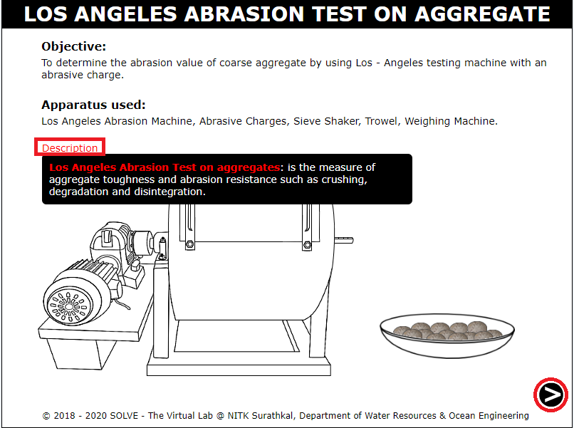 

2. Select the grade of aggregate to be used in the test and note down its specification. Click on NEXT button to proceed. 
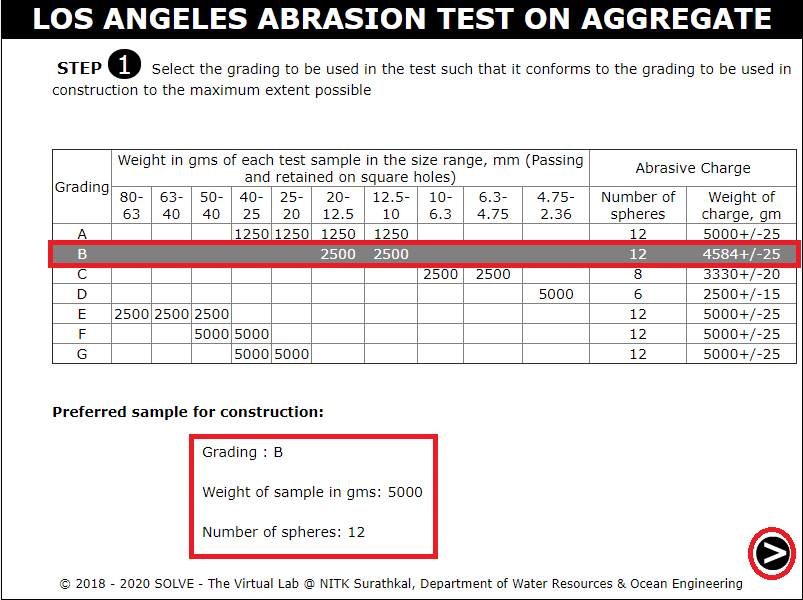 

3. Click on each sieve to arrange them in ascending order of their size, click on the sample to pass it through the sieve. 
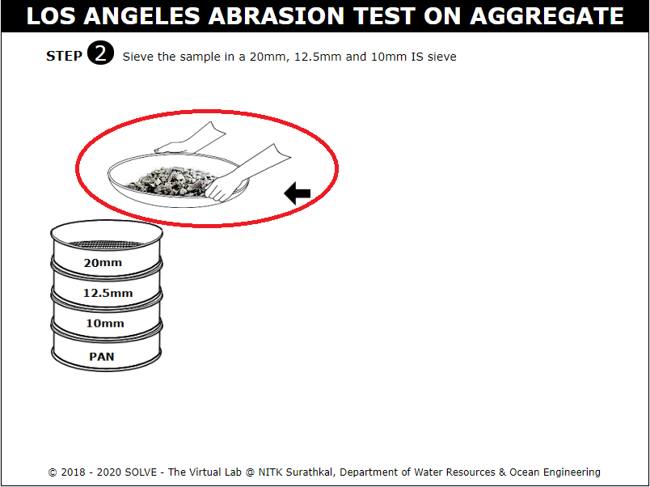 

4. Click on the set of sieves to place it on the sieve shaker. Click ON to sieve the aggregate. 
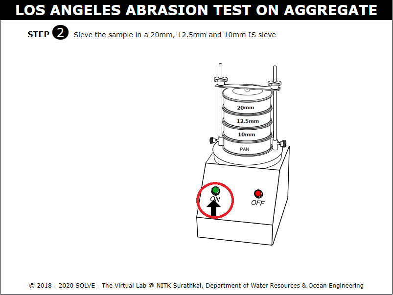 

5. Answer the question by selecting the correct answer to proceed with the simulation. 
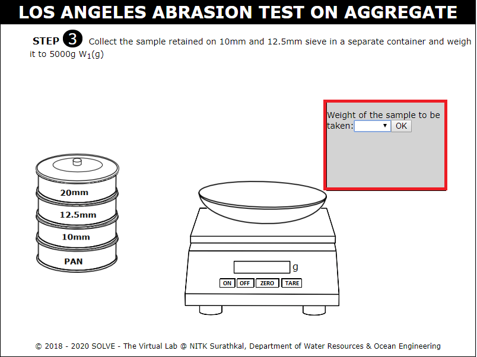 

6. Click on 12.5 mm sieve and 10mm sieve to weigh the aggregate retained on it W1(g). Click on NEXT button to proceed. 
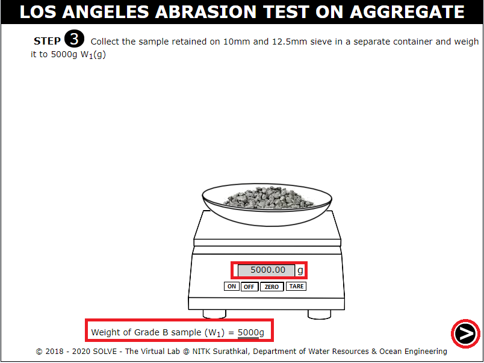 

7. Open the cover of Los Angeles Abrasion test drum by clicking on the bolts to remove them. 
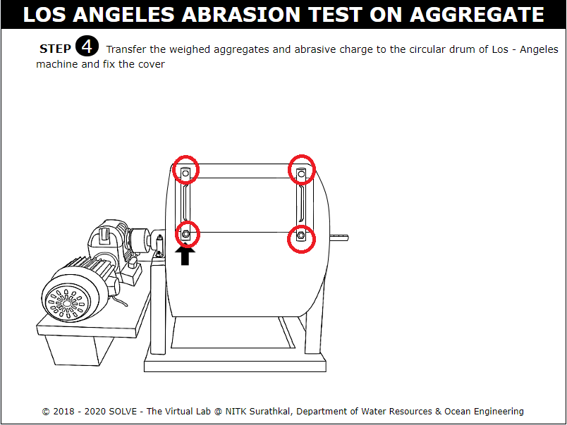 

8. Click on the aggregates and abrasive charge to add them to the cylinder, answer the question to proceed with the simulation. 
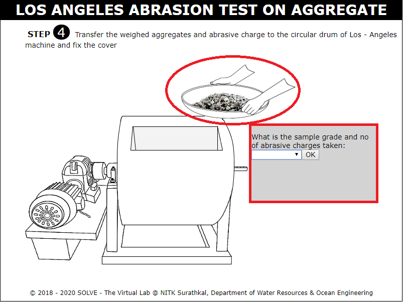 

9. Click on the machine to rotate the drum, the number of rotation and time taken is noted. 
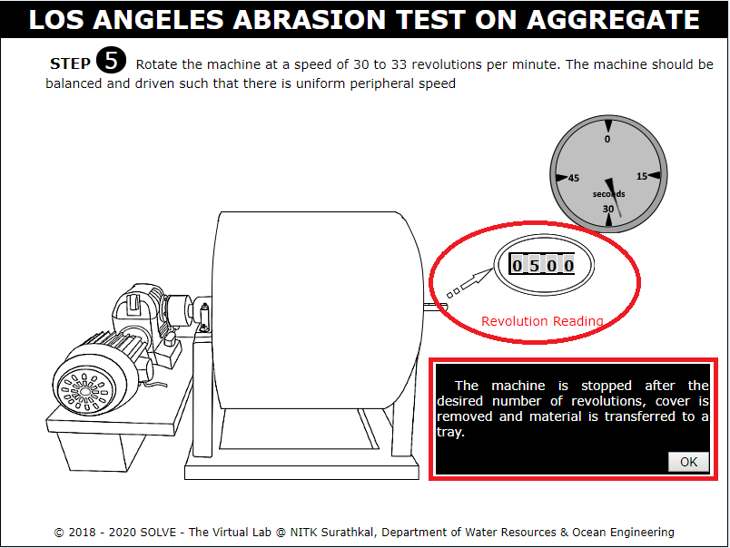 

10. Click on the sieve to arrange them, click on trowel to add the stone dust to sieve 1.7mm, then place the set of sieves in shaker. 
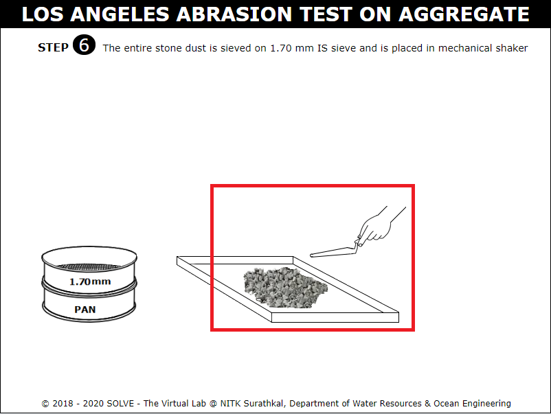 

11. Weigh the material coarser than 1.7mm size and obtain the weight W2(g). Click on NEXT button to proceed. 
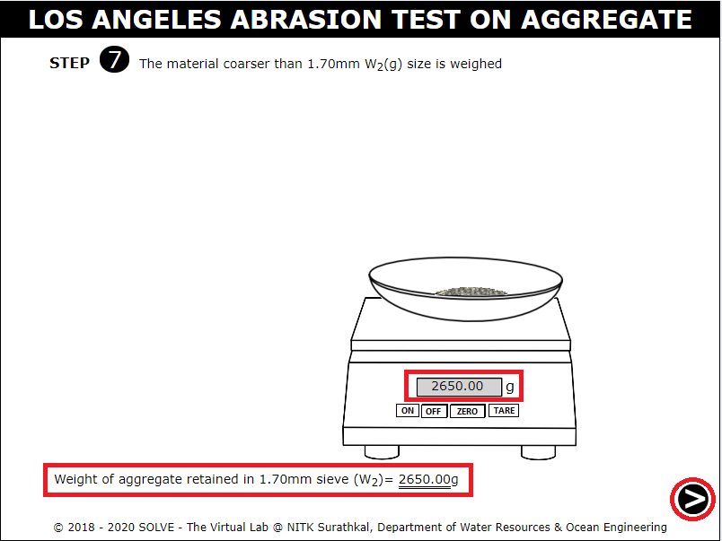 

12. Note down the observation and calculate the percentage wear, also go through the inference. 
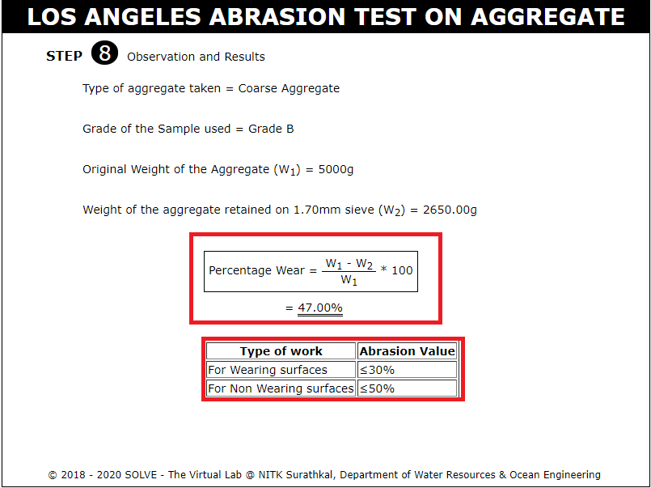 
