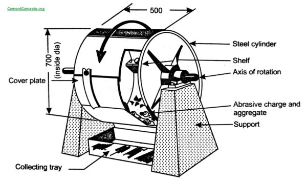

### INTRODUCTION 

Aggregates undergo significant wear and tear throughout their life. Aggregates must be hard and tough enough to resist crushing, degradation and disintegration and be able to transmit loads from the pavement surface to the underlying layers and eventually the subgrade. Testing the strength of parent rock alone does not exactly indicate the strength of aggregates in concrete. For this reason assessment of strength of the aggregates are made by using a sample bulk aggregates in standardized manner. The principal mechanical property of aggregate required in any construction is

<ol style="text-indent:25px; text-align:justify;list-style-position: inside">
<li>Satisfactory resistance to crushing under the roller during construction</li>
<li>Adequate resistance to surface abrasion under traffic</li>
</ol>

Los Angeles Abrasion Testing Machine

(Source: <a href="https://cementconcrete.org/transportation/los-angeles-abrasion-test-la-on-aggregate/2377/"">https://cementconcrete.org/transportation/los-angeles-abrasion-test-la-on-aggregate/2377/</a>)
 

Aggregates used in road construction should be strong enough to resist abrasion and crushing under traffic wheel load. If aggregates are weak the stability of pavement structure is adversely affected. If the aggregates used are not resistant to abrasion it may cause premature failure or a loss of skid resistance of pavements, also poor resistance to abrasion can produce excessive dust. Abrasion test is carried out on the aggregate sample to test the hardness property of aggregates and to decide whether they are suitable for different pavement construction works. Los Angeles test is widely used to test abrasion of aggregate and the method has been standardized in India (IS:2386 part-IV). The Los Angeles abrasion test finds the percentage wear due to relative rubbing action between the aggregate and steel balls.

Los Angeles machine has a circular rotating drum of length 520 mm and internal diameter 700 mm mounted on horizontal axis. An abrasive charge consisting of cast iron spherical balls of 48 mm diameters and weight 340-445 g is placed in the cylinder along with the aggregates based on the selected grading. The number of the abrasive spheres varies according to the grading of the sample. The quantity of aggregates to be used depends upon the grading and usually ranges from 5-10 kg. The cylinder is then locked and rotated at the speed of 30-33 rpm for a total of 500 -1000 revolutions depending upon the gradation of aggregates. After specified revolutions, the material passing 1.7 mm IS sieve is measured and expressed as percentage total weight of the sample. This value is called Los Angeles abrasion value.

The table below shows limits of Los Angeles abrasion value for different types of road construction:

<table style="width:800px;margin-left: 0;text-align:center;">
<tr style="text-align:center">
<th style="text-align:center;height:50px;width:2%">Type of Pavement</th>
<th style="text-align:center;height:50px;width:0.5%">Max. permissible abrasion value in %</th>
</tr>
<tr style="text-align:center;height:50px;">
<td> Water bound macadam sub base course</td>
<td> 60</td>
</tr>
<tr style="text-align:center;height:50px;">
<td>WBM base course with bituminous surfacing</td>
<td>50</td>
</tr>
<tr style="text-align:center;height:50px;">
<td>Bituminous bound macadam</td>
<td>50</td>
</tr>
<tr style="text-align:center;height:50px;">
<td>WBM surfacing course</td>
<td>40</td>
</tr>
 <tr style="text-align:center;height:50px;">
<td>Bituminous penetration macadam</td>
<td>40</td>
</tr>
<tr style="text-align:center;height:50px;">
<td>Bituminous surface dressing, cement concrete surface course</td>
<td>35</td>
</tr>
<tr style="text-align:center;height:50px;">
<td>Bituminous concrete surface course</td>
<td>30</td>
</tr>
</table>

(Source: IS 2386(Part 4):1963)
 

<strong>Relevant Indian Standard for Los Angeles Abrasion Test on Aggregate</strong>:

<ol style="text-indent:25px; text-align:justify;list-style-position: inside">
<li>IS 2386 (Part IV) 1963: Methods of Test for Aggregates Mechanical Properties, Tenth Reprint MARCH 1997.</li>
<li>IS 383-1970: Specification for Coarse and Fine Aggregates.</li>
</ol>
